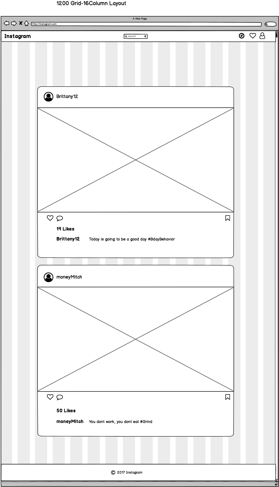
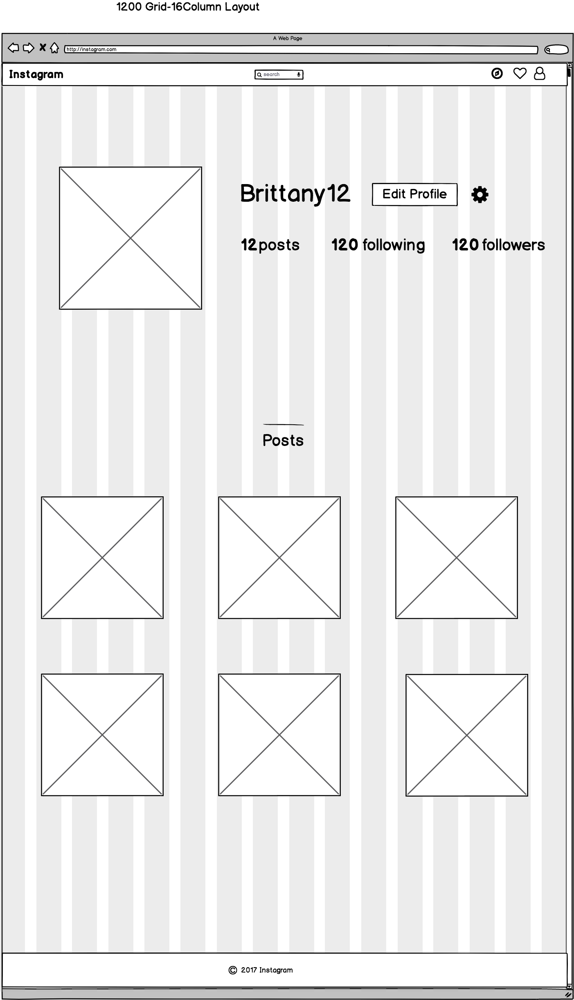
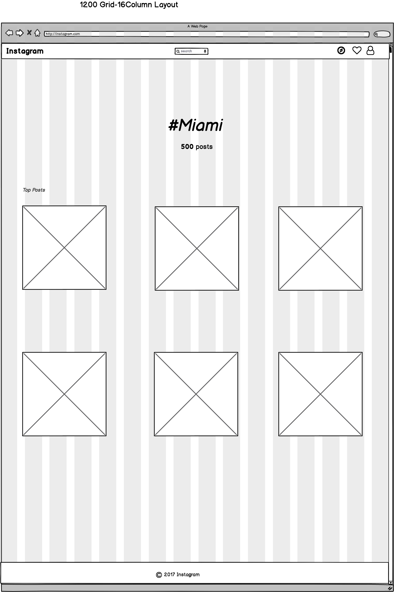
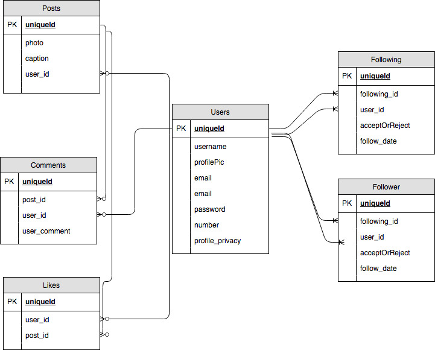

# Instagram Clone


----

**What is this?** 

This is my own version of instagram.

---


## Technologies Used

```js
 HTML/CSS
 Express
 Handlebars
 Knex/ PostgreSQL
 Socket.IO
 
```


## Site Layout








## IG_Clone Database Diagram



## Features

  * Upload/ Delete Media (photos)
  * Registration
  * Send Direct Messages
  * Search
  * News Feed
  * Ability to Follow/ Unfollow
  * Like Content
  * Search & Iterate for Location, Users, Hashtags


## Advanced Features

  * Ability for user to pick a certain filter for their pictures


  ## Challenges

  * Setting relations for friends following other friends
  * Setting it up so user only sees people they are following
  * Adding the abiltiy for users to add hashtag categories based off what content they tag
  * Capturing hashtags, that users use in their post caption


  ## Requirements

  - [X] User should be able to register
  - [X] User should be able to login
  - [X] User should be able to post content
  - User should only be able to see the posts of users that they are following
  - [X] Users should be able to see their own profile page
  - [X] Users should be able to see the profile pictures of others users
  - Users should can go see other profile pictures, but wont be able to actually see the posts of users they arent following.
  - Users should be able to search for content associated with certain tags
  - [X]  Users should be able to like post
  - [X] Users should be able to unlike posts
  - [X]  Users should only get be able to like one time per post
  - [X]  Users should be able to comment on posts


   ## Problems/Challenges/Solutions

   * Switched from Bootstrap 3 to 4, for the ability to utilize flexbox.
   * Maybe using regex so when user uses a hashtag on caption we put it in that category


   ## Gotchas to learn from

   * order your tables in your drop function inside the db/migration file, based on relation. Delete tables that rely on other tables first.
   * when seeding database in knex js , dont add id values manually. If you do it will mess up that auto incrementing procress
   * Use bootstrap 4 for its ability to use flexbox
   * You cant use #each inside of a #if statement in handlebars smh
   * Order of seeding is important.
   * If you are storing a number on the request.params object, realize that the data type is a string and not a number. You'll have to convert it to a number with parseInt() method.
   * To get a promise back when running a `insert()` in knexjs use `returning()`
   * You cannot use `#` in a url. If you do the browser will skip the part that has `/#some/url` and load `\` - https://stackoverflow.com/questions/17744003/get-url-after-in-express-js-middleware-request


   ## Lessons Learned

   * to send a input when user presses enter without showing and having the submit button visible, set the submit button/input to display none or hidden
   ```js
<input type="submit" style="display: none" />
 
```
* Awesome knex js cheatsheet: https://devhints.io/knex
* In express you can use multiple parameters in url - https://stackoverflow.com/questions/15128849/using-multiple-parameters-in-url-in-express